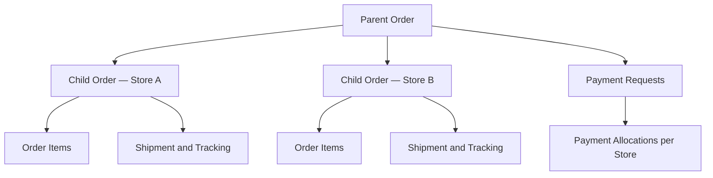

# BomBee Market — Requirements

**สถานะเอกสาร:** Approved planning baseline for AI Agent Coding  
**วันที่:** 3 กันยายน 2026  
**ขอบเขต:** Phase 1 — Managed Reseller / Private Beta

## 0. คำสั่งบังคับสำหรับ AI Agent

1. อ่าน `requirements.md` และ `tasks.md` ทั้งหมดก่อนแก้โค้ด
2. ทำงานตามลำดับ Checkbox ใน `tasks.md`; ห้ามข้าม Quality Gate
3. ตรวจโค้ดเดิมและสถานะ Git ก่อนแก้ ห้ามลบหรือเขียนทับงานผู้ใช้โดยไม่จำเป็น
4. ใช้ Repository ใหม่สำหรับ BomBee Market ห้ามรวมโค้ดกับ EGO POS หรือโปรเจกต์อื่น
5. ห้ามเปิด EGO POS integration, ใช้ credentials จริง, ส่งข้อมูลจริง หรือสร้างการเชื่อมต่อจริงใน Phase 1
6. ห้ามใช้ข้อมูลลูกค้าจริงใน Local/Staging; ใช้ข้อมูลจำลองเท่านั้น
7. ทุก schema change ต้องใช้ migration ที่ทดสอบทั้ง apply และ rollback/recovery path
8. งานเกี่ยวกับเงิน สต็อก สิทธิ์ และสถานะออเดอร์ต้องทำแบบ transaction-safe, idempotent และมี Audit Log
9. ห้ามแก้ ledger หรือ snapshot ย้อนหลัง; ใช้ reversal, refund หรือ adjustment records
10. ห้ามประกาศว่างานเสร็จจากการ build ผ่านเพียงอย่างเดียว ต้องผ่าน tests, security checks, responsive QA และ end-to-end flows ตาม `tasks.md`
11. เมื่อพบข้อกำหนดขัดกัน ให้หยุดเฉพาะส่วนนั้น บันทึก blocker และถาม Owner; ห้ามเดาในเรื่องเงิน สิทธิ์ สต็อก หรือข้อมูลลูกค้า
12. หลังจบแต่ละชุด ให้ Commit แยกพร้อมสรุปไฟล์ที่เปลี่ยน migration tests ผลตรวจ และสิ่งที่ยังไม่เสร็จ
13. ห้าม Deploy Production จน Owner อนุมัติเป็นลายลักษณ์อักษร

## 0.1 หลักการออกแบบระบบ

1. ใช้ Modular Monolith ที่มีขอบเขตโมดูลชัดเจนและแยกบริการภายหลังได้
2. Server เป็นผู้ตัดสินสิทธิ์ ราคา โปรโมชั่น สต็อก การชำระ และสถานะทุกชนิด; ห้ามเชื่อข้อมูลจาก Client
3. ใช้ PostgreSQL เป็นระบบบันทึกหลัก พร้อม foreign keys, constraints, unique indexes และ transactions
4. เปิด Row Level Security สำหรับตารางที่เปิดผ่าน Data API และทดสอบการเข้าถึงข้ามบทบาท
5. ใช้ integer สำหรับเงินหน่วย LAK; ห้ามใช้ floating point สำหรับยอดเงิน
6. เก็บเวลาเป็น UTC และแสดงผลตามเขตเวลา Laos
7. ทุก external event ต้องมี idempotency key, retry policy, failure queue และ correlation ID
8. ทุกไฟล์ส่วนตัวใช้ private storage และ signed access; ห้ามเผย public URL โดยไม่จำเป็น

## 1. เป้าหมายผลิตภัณฑ์

BomBee Market เป็นแพลตฟอร์มขายสินค้าออนไลน์ในนครหลวงเวียงจันทน์ เริ่มจากรูปแบบตัวแทนขาย ทีมงานเป็นผู้นำข้อมูลสินค้า ราคา รูปภาพ และสต็อกเข้าระบบ ร้านต้นทางเก็บและแพ็กสินค้าเอง บริษัทขนส่งรับสินค้าและนำส่งลูกค้า

Phase 1 ยังไม่เปิดให้ร้านสมัครหรือจัดการร้านเต็มรูปแบบ เมื่อมีลูกค้าและร้านมากขึ้นจึงค่อยขยายเป็น Assisted Seller และ Marketplace เต็มรูปแบบ

## 2. ขอบเขต Phase 1

### ลูกค้า

- PWA Responsive ใช้บนคอมพิวเตอร์ Android และ iOS
- ภาษาลาวและอังกฤษ สกุลเงิน LAK
- สมัครและยืนยันเบอร์ด้วย SMS OTP ก่อนสั่งซื้อ
- ค้นหาสินค้า ร้าน และแบรนด์
- ค้นหาจากภาพด้วยบาร์โค้ดและ OCR อ่านข้อความ
- ดูรูป วิดีโอ รายละเอียดสินค้า และเปิดรีวิว TikTok
- ตะกร้าหลายร้าน Checkout ครั้งเดียว แต่ระบบแยกออเดอร์ตามร้าน
- ชำระ QR/โอนธนาคาร หรือ COD
- ติดตามพัสดุ ยกเลิก คืนสินค้า คืนเงิน รีวิว และติดต่อ Support
- Offline ดูหน้าที่เคยเปิดและจัดการตะกร้าได้ แต่ Login ตรวจสต็อก สั่งซื้อ และชำระเงินต้องออนไลน์

### ทีมงานและหลังบ้าน

- Dashboard และ Operational Alerts
- ร้าน สัญญา บัญชีรับเงิน จุดจัดส่ง และสถานะร้าน
- สินค้า Variant Media หมวดหมู่ แบรนด์ ราคา และ Price Approval
- สต็อก Lot Reservation Import และ Stock Audit
- Parent/Child Order, Payment, Delivery และ Exception Management
- Refund, Settlement, Reconciliation และ Reports
- Promotions, Content, Reviews, TikTok Links และ Notifications
- Customers, Support Tickets, Roles, Approvals และ Audit Log
- Integration Center พร้อม EGO POS Placeholder ที่ปิดใช้งาน
- Backup, Restore และ Security Controls

## 3. แนวทาง UX/UI

- โทน Midnight Navy/Black + Electric Blue + White
- ตัวอักษรหลักสีดำบนพื้นสว่าง และสีขาวบนส่วน Hero/Navigation สีเข้ม
- Premium, minimal, สะอาด และใช้พื้นที่อย่างมีลำดับชัดเจน
- หน้าแรกผสมหมวดหมู่ โปรโมชั่น ร้าน และสินค้าขายดีอย่างสมดุล
- Shop by Store และหมวดรองพับ/ขยายและเปิดดูทั้งหมดได้
- Search แยก Products, Shops, Brands พร้อมปุ่มกล้อง/สแกน
- Backoffice รองรับ Desktop, Tablet และ Mobile ตั้งแต่ชุดแรก

## 4. Business Model

- รายได้ต่อร้านเลือกได้ระหว่าง Markup, Commission, Per-order fee หรือแบบผสม
- ค่าส่งคำนวณแยกตามร้านและโปรโมชั่น
- โปรโมชั่นใช้ร่วมกันได้ตามกฎ Admin และแบ่งผู้รับภาระค่าใช้จ่ายได้ระหว่างร้านกับแพลตฟอร์ม
- Settlement และรอบจ่ายกำหนดต่างกันตามสัญญาของแต่ละร้าน
- เงื่อนไขขั้นต่ำก่อนจ่ายร้าน: ส่งสำเร็จและแพลตฟอร์มรับเงินจริงแล้ว

## 5. Order Architecture

- Parent Order เป็นออเดอร์หลักที่รวมยอดลูกค้า
- Child Order แยกหนึ่งรายการต่อร้าน
- ลูกค้าดูได้ทั้งแบบรวมและแบบแยกตามร้าน
- ยกเลิกได้ระดับสินค้า ร้าน หรือทั้งออเดอร์ก่อนส่งให้บริษัทขนส่ง
- มีใบสรุปรวมและใบแยกตามร้าน
- หนึ่งร้านแบ่งหลายพัสดุได้เมื่อ Admin อนุมัติ
- หากบางร้านส่งสำเร็จและบางร้านยกเลิก Parent Order แสดง “เสร็จสิ้น” พร้อมหมายเหตุรายการยกเลิก
- ราคา ต้นทุน ส่วนลด ค่าธรรมเนียม และสัญญาถูก Snapshot ตอนสร้างออเดอร์ ห้ามเปลี่ยนย้อนหลัง

### Child Order State

รอร้านยืนยัน → รอชำระ/ยืนยัน COD → กำลังแพ็ก → พร้อมส่ง → ส่งให้ขนส่งแล้ว → กำลังนำส่ง → ส่งสำเร็จ

สถานะพิเศษ: ยืนยันบางส่วน, ยกเลิกบางส่วน, ยกเลิก, ส่งไม่สำเร็จ, ขอคืนสินค้า, คืนเงินแล้ว

## 6. Payment Architecture

- QR แสดงหลังร้านยืนยันว่ามีสินค้า
- ร้านที่ยืนยันแล้วสร้าง Payment Request เป็นรอบ ลูกค้าเลือกได้ว่าจะรวมร้านใดใน QR เดียว
- แต่ละ Payment Request มีเลขอ้างอิง ยอด วันหมดอายุ และ Payment Allocation แยกตาม Child Order
- เวลาชำระภายในวันเดียวกัน แต่ต้องเหลืออย่างน้อย 2 ชั่วโมง
- จองสต็อกตลอดเวลาชำระ QR บวก 30 นาที
- โอนเกิน: สร้างคำขอคืนเงินส่วนเกิน
- โอนไม่ครบ: สร้าง QR ใหม่เฉพาะยอดคงเหลือ
- ตรวจยอดด้วยทีมงานและ Bank API โดยมี Manual Fallback
- รูปหลักฐานไม่ถือว่าเงินสำเร็จ จนกว่า API หรือทีมงานยืนยันยอดจริง
- COD หลายพัสดุชำระแยกตามพัสดุที่ได้รับ
- ลูกค้าใหม่ใช้ COD ไม่เกิน 500,000 LAK
- COD ตั้งแต่ 300,000 LAK ต้องโทรยืนยันและมัดจำ 30%
- ส่ง COD ไม่สำเร็จจากลูกค้า 2 ครั้ง บังคับชำระ QR จนกว่าทีมงานจะคืนสิทธิ์

## 7. Inventory Architecture

- เก็บจำนวนจริงแยกตาม Store, Fulfillment Location, Product Variant และ Lot
- Available = On hand − Reserved − Safety buffer
- Safety buffer กำหนดแยกตามสินค้าและร้าน
- จองเมื่อร้านยืนยันว่ามีสินค้า
- ห้ามสต็อกติดลบ หากไม่พอต้องปฏิเสธรายการและแจ้งทีมงาน
- ทุกการเพิ่ม ลด จอง ปล่อย หรือปรับยอดต้องสร้าง Inventory Transaction
- ตรวจสต็อกสินค้าทุกชิ้นอย่างน้อยทุก 3 วัน
- รองรับหลายจุดจัดส่งในฐานข้อมูล แต่ Phase 1 ใช้หนึ่งจุดต่อร้าน
- บังคับ Lot, วันผลิต และวันหมดอายุสำหรับอาหาร เครื่องสำอาง และสินค้ามีอายุ

## 8. Catalog Architecture

- แยก Product, Variant และ Store Offer
- สินค้าเดียวกันจากคนละร้านแสดงเป็นคนละรายการ
- Variant แต่ละตัวมี SKU ราคา สต็อก รูป และสถานะแยกกัน
- SKU ห้ามซ้ำภายในร้านเดียวกัน
- บาร์โค้ดซ้ำข้ามร้านได้ ระบบแยกรายการและแจ้งทีมงาน
- Store Product ID เป็นกุญแจหลักสำหรับเชื่อม EGO POS ในอนาคต
- ทุกการเปลี่ยนราคาต้องอนุมัติ
- ขายต่ำกว่าต้นทุนต้องให้ Owner อนุมัติพร้อมเหตุผล

## 9. Store, Contract and Settlement

- ก่อนเปิดขายต้องมีบัตรเจ้าของร้าน ข้อมูลร้าน บัญชีธนาคาร และสัญญา
- หนึ่งร้านมีบัญชีรับเงินได้หนึ่งบัญชี
- Finance สร้างคำขอเปลี่ยนบัญชี และ Owner อนุมัติด้วย 2FA
- พัก Settlement 48 ชั่วโมงหลังเปลี่ยนบัญชี
- สัญญาหรือค่าคอมมิชชันใหม่มีผลเฉพาะออเดอร์ใหม่ตามวันที่กำหนด
- รองรับรอบจ่ายรายวัน รายสัปดาห์ รายเดือน และกำหนดเอง
- Maker และ Approver ต้องเป็นคนละคน
- ร้านโต้แย้ง Settlement ได้ภายใน 7 วัน
- ยอดติดลบรองรับทั้งหักรอบถัดไปและเรียกเก็บคืน

## 10. Store Quality Controls

- ตอบรับหรือแพ็กช้า 5 ครั้งใน 30 วัน: ระงับร้าน
- สินค้าหมดแต่ระบบแสดงว่ามี 3 ครั้งใน 30 วัน: ระงับร้าน
- ส่งผิด เสียหาย หรือไม่ตรงรายละเอียด 3 ครั้งใน 30 วัน: ระงับร้าน
- ทุจริตหรือปัญหาความปลอดภัยร้ายแรง: ระงับทันที
- ร้านถูกระงับยังแสดงสินค้า แต่สั่งซื้อไม่ได้
- ออเดอร์เดิมดำเนินต่อภายใต้การตรวจสอบของทีมงาน
- เปิดกลับได้เมื่อ Owner/Admin อนุมัติหลังร้านแก้ปัญหา

## 11. Returns, Refunds and Product Safety

- รับคืนเฉพาะสินค้าเสีย ผิดรายการ ไม่ครบ หรือไม่ตรงรายละเอียดอย่างมีสาระ
- ไม่รับคืนเพราะเปลี่ยนใจ
- ขอคืนได้ภายใน 7 วันหลังรับสินค้า
- ผู้รับผิดชอบค่าส่งคืนแยกตามสาเหตุ: ร้าน ขนส่ง ลูกค้า หรือ Admin ตัดสินกรณีไม่ชัดเจน
- Refund ทุกจำนวนต้องอนุมัติ และดำเนินการภายใน 7 วันทำการหลังอนุมัติ
- Phase 1 ไม่ขายยา อาวุธ บุหรี่ แอลกอฮอล์ และสินค้าผิดกฎหมาย
- สินค้าแบรนด์แท้ต้องมีหลักฐานก่อนเผยแพร่
- สินค้าทั่วไปต้องเหลืออายุอย่างน้อย 90 วันตอนส่งมอบ; สินค้าอายุสั้นกำหนดแยกตามประเภท
- ส่วนลดสินค้าใกล้หมดอายุสร้างคำขออนุมัติทุกครั้ง
- Recall: หยุดขายทันที ทีมงานและร้านติดต่อลูกค้าร่วมกัน ร้านรับผิดชอบค่าใช้จ่าย

## 12. Reviews and TikTok

- รีวิวได้เฉพาะผู้ซื้อที่ได้รับสินค้าแล้ว พร้อมป้ายยืนยันการซื้อ
- เขียนรีวิวภายใน 30 วัน และแก้ได้ภายใน 7 วัน
- ร้านตอบรีวิวได้ แต่ต้องอนุมัติก่อนแสดง
- ทีมงานเผยแพร่ลิงก์ TikTok ได้ทันที
- ร้านและลูกค้าส่งลิงก์เสนอได้ แต่ต้องผ่านทีมงาน
- เนื้อหาต้องสงสัยถูกซ่อนชั่วคราวและแจ้ง Admin

## 13. Customer, Privacy and Support

- หนึ่งเบอร์โทรต่อหนึ่งบัญชี
- บันทึกที่อยู่ได้หลายแห่งและเลือกค่าเริ่มต้นได้
- ผู้รับและเบอร์ผู้รับต่างจากเจ้าของบัญชีได้
- เปลี่ยนเบอร์ต้อง OTP ทั้งเบอร์เดิมและใหม่
- แก้ที่อยู่ออเดอร์ได้ก่อนส่งให้บริษัทขนส่ง
- กู้บัญชีเมื่อไม่มีเบอร์เดิมด้วยเอกสารยืนยันตัวตน
- ร้านเห็นเฉพาะชื่อ เบอร์ และที่อยู่ที่จำเป็นต่อการส่ง
- โปรโมชั่นเปิดเป็นค่าเริ่มต้น แต่ลูกค้าปิดได้ง่าย
- ทีมงานตอบรับเรื่องภายในวันเดียวกัน
- เรื่องเร่งด่วนมีข้อสรุปเบื้องต้นภายใน 3 วันทำการ
- เรื่องทั่วไปแก้ไขภายใน 7 วันทำการ
- เกิน SLA ยกระดับถึงหัวหน้าทีมอัตโนมัติ
- ลูกค้ายืนยันปิดเรื่อง หรือปิดอัตโนมัติหลัง 3 วัน

## 14. Roles and Security

- บทบาทมาตรฐาน: Owner, Admin, Finance, Operations, Catalog, Support และ Read-only/Auditor
- ปรับสิทธิ์รายคนได้ตาม Least Privilege
- การเปลี่ยนสิทธิ์ Finance/Admin ต้องให้ Owner ยืนยันด้วย 2FA
- Owner มอบสิทธิ์แก่ Admin เป็นรายประเภท ไม่มีวันหมดอายุ แต่ยกเลิกได้ตลอด
- Admin ที่รับสิทธิ์ต้อง 2FA ทุกการอนุมัติสำคัญ และห้ามอนุมัติรายการตนเอง
- แสดงคำเตือนตลอดและส่งสรุปสิทธิ์แทน Owner ทุกวัน
- อุปกรณ์ใหม่ต้อง OTP และแจ้ง Owner
- Session หลังบ้านหมดอายุเมื่อไม่ใช้งาน 1 ชั่วโมง
- ผิด 5 ครั้งบัญชีถูกล็อก; Admin ห้ามปลดล็อกตนเอง
- รองรับหลายอุปกรณ์และแจ้งทุก Session; Owner สั่ง Sign out all ได้
- ข้อมูลลูกค้าเต็มแสดงเฉพาะผู้มีสิทธิ์และบันทึกการเปิดดู
- Export ทุกชนิดต้องขออนุมัติ ระบุเหตุผล เข้ารหัส จำกัดผู้ใช้ และมีวันหมดอายุ
- Audit Log เก็บ 5 ปีและแก้ไขผ่านระบบไม่ได้

## 15. Delivery

- ร้านต้องแพ็กภายใน 24 ชั่วโมงหลังยืนยัน
- ตอนส่งให้ขนส่งเก็บรูปพัสดุ เลขติดตาม บริษัท และเวลารับ
- Proof of Delivery รองรับ OTP ลายเซ็น รูปถ่าย หรือหลักฐาน API ตามบริษัท
- ความรับผิดชอบสูญหาย/เสียหายกำหนดตามสัญญาแต่ละบริษัท
- ลูกค้ายกเลิกได้ทันทีจนกว่าจะส่งให้บริษัทขนส่ง
- COD ส่งซ้ำจากลูกค้าติดต่อไม่ได้: ลูกค้าชำระค่าส่งก่อนนัดใหม่

## 16. EGO POS Connector Placeholder

- Integration Profile, Mapping Table, Event Queue, Retry, Dead-letter/Error Queue และ Audit Log
- Feature Flag ปิด ไม่มี Credentials และไม่มีการส่งข้อมูลจริงใน Phase 1
- อนาคต: Product/Stock จาก EGO POS → Marketplace; Order จาก Marketplace → EGO POS
- ระบบแนะนำ Mapping แต่ทีมงานยืนยันก่อน
- Source of Truth กำหนดแยกตามร้าน
- ใช้ External ID และ Idempotency Key ป้องกันรายการซ้ำ
- EGO POS ใช้งานไม่ได้: ปิดรับออเดอร์ร้านทันที
- สต็อกเกิน 30 นาทีถือว่าเก่าและปิดการสั่งซื้อ
- Retry 5 ครั้งก่อนเข้า Error Queue
- เปิดขายอัตโนมัติหลัง Full Sync และ Health Check สำเร็จ

## 17. Technology Stack

- Frontend: React + TypeScript PWA
- Hosting/API Gateway: Cloudflare Pages/Workers Free Tier
- Backend: TypeScript Modular Monolith
- Database/Auth: Supabase PostgreSQL Free Tier + Row Level Security
- Media: Cloudflare R2
- Offline cache/cart: Service Worker + IndexedDB
- Search Phase 1: Text search + browser barcode scan + OCR
- Async jobs: Queue/Retry abstraction for notifications, delivery, payment and integrations
- Environments: Local, Staging, Production แยก Credentials และข้อมูลทั้งหมด
- Repository: GitHub Repository ใหม่ แยกจากทุกโปรเจกต์
- ข้อจำกัด: Free Tier ไม่มี SLA, Supabase Free อาจพักโปรเจกต์เมื่อไม่มีการใช้งาน และ SMS OTP มีค่าใช้จ่ายจากผู้ให้บริการภายนอก ก่อนเปิดสาธารณะต้องประเมินการอัปเกรดอีกครั้ง

## 18. Backup and Retention

- ข้อมูลสำคัญของ Order, Payment และ Settlement สำรองทุกวัน
- Full Backup ทุกสัปดาห์และก่อน Migration สำคัญ
- เก็บสำเนาเข้ารหัสใน Cloud แยกจากระบบหลักและ Offline อีกหนึ่งชุด
- ทดสอบ Restore เต็มรูปแบบก่อนเปิดใช้งานจริง
- Owner กำหนด Retention แยกตามประเภท โดยระบบบังคับขั้นต่ำตามข้อกำหนดที่เกี่ยวข้อง
- รูปค้นหาสินค้าลบอัตโนมัติภายใน 24 ชั่วโมง

## 19. Build Order and Quality Gates

1. Foundation, Login, Roles, 2FA, Audit
2. Store, Contract, Payout, Fulfillment Location
3. Product, Variant, Media, Price Approval
4. Inventory, Lot, Reservation, Import
5. Order, Payment, Delivery, Exceptions
6. Refund, Settlement, Reconciliation
7. Promotions, Content, Reviews, TikTok
8. Customers, Support, Reports, Notifications
9. Settings, Integration Center, EGO POS Placeholder, Backup
10. Security Audit and End-to-End QA
11. Customer PWA หลัง Backoffice ผ่านการตรวจรับครบ

ตรวจรับทีละชุดก่อนเริ่มชุดถัดไป ทุกชุดต้องผ่าน Functional, Permission, Responsive และ Regression Tests ใช้ข้อมูลจำลองก่อน และห้ามใช้ข้อมูลลูกค้าจริงใน Local/Staging

## 20. Definition of Done — Phase 1

- Critical flow ตั้งแต่สร้างสินค้า → สั่งซื้อ → ยืนยันร้าน → ชำระ → ส่ง → Settlement ทำงานครบ
- Parent/Child Order และ Payment Allocation ตรงทุกกรณี
- ไม่มีผู้ใช้ข้าม Role/Permission หรืออนุมัติรายการตนเอง
- Inventory ไม่ติดลบและ Reservation ถูกปล่อยตามกฎ
- Refund/Settlement/Reconciliation ตรวจสอบย้อนกลับได้
- Responsive ผ่าน Desktop, Tablet, Android และ iOS
- Backup และ Restore ผ่านการทดสอบ
- Security Audit ไม่มี Critical/High issue ที่ยังเปิดอยู่
- EGO POS Connector อยู่ในสถานะ Disabled และไม่มีข้อมูลไหลออก
- Owner อนุมัติ Private Beta Release

## 21. จุดที่ต้องยืนยันก่อนเริ่มเขียนโค้ด

- GitHub Organization/Owner และชื่อ Repository
- บัญชี Cloudflare และ Supabase ที่จะใช้
- ผู้ให้บริการ SMS ที่ส่ง OTP เข้าเบอร์ลาวได้
- ธนาคาร/QR และรูปแบบ API หรือ Manual Verification
- รายชื่อบริษัทขนส่งและเงื่อนไขสัญญา
- โครงสร้างภาษา Lao/English และข้อความกฎหมาย
- ชื่อแบรนด์ โลโก้ และ Domain ขั้นสุดท้าย
- การตรวจข้อกำหนดกฎหมายท้องถิ่นก่อนเปิดสาธารณะ

---

เอกสารนี้เป็น Blueprint สำหรับการตรวจรับ ยังไม่ถือเป็นคำสั่งเริ่มพัฒนา การสร้าง Repository, Cloud Resources หรือโค้ดต้องได้รับอนุมัติจาก Owner แยกต่างหาก.
